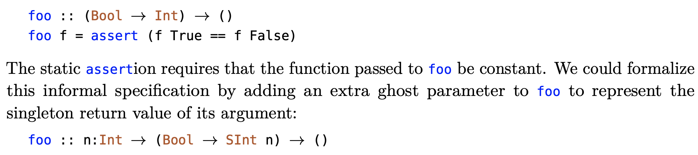
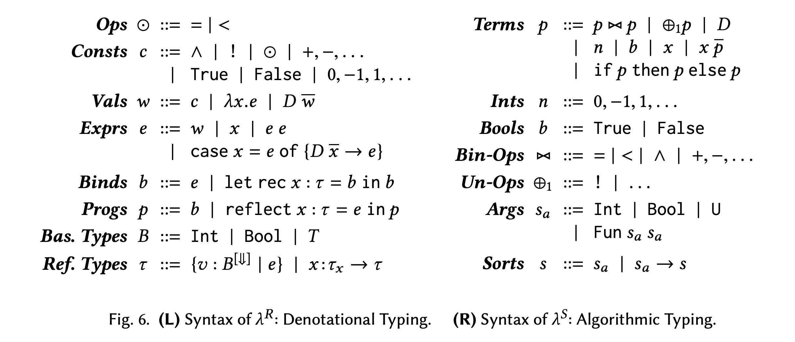
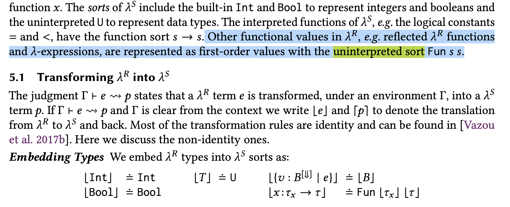

## Function as return value


```OCaml
let div_by_one = (div 1)
(*@
declare div_by_one()
requires    { true }
ensures  [f]{ true with 
                f(x) |= { true } *->:m { m * 1 = x } }
@*)

let twice f x = f (f x)
(*@
declare twice(f,x)
given Q(int, int)
requires    { true with
                f(x) |= {true} *->:r {Q(x,r)} }
ensures  [r]{EX (m:int), Q(x,m) & Q(m,r) }
@*)

let div_by_one_twice x = twice div_by_one x
(*@
declare div_by_one_twice(x)
requires    { true }
ensures  [r]{ r=x }
@*)
```

At call site, the verifier looks up `div_by_one` in the specifications and checked that it has zero arguments, it will check the pre-condition of `div_by_one`, if satisfied, the returned specification will be updated into the environment.


## Recursive reasoning

```OCaml
let rec fact n =
  if n = 0 then 1 else (n * (fact (n - 1)))

(*@
declare fact(n)
requires { 0<=n }
ensures[res] { factP(n,res) }


pred factP(q1:int,q2:int) |=
    q1 = 0 & q2 = 1
or  EX (r_ex:int), q2 = r_ex * q1 &   factP(q1 - 1,r_ex)
@*)
```

For the second branch, we want to derive
```
n != 0 & res = n * x & factP(n-1,x)
|-- factP(n,res)
```

Solution: just encode the constraint of the uninterpreted function `factP` to the solver
```
forall q1, q2, 
exists r_ex, q2 = r_ex * q /\ factP(q1-1,r_ex)
|-- factP(q1,q2)
```


## "Auxiliary variables" or ghost variables

[ECOOP 21] Refinements of Futures Past: Higher-Order Specification with Implicit Refinement Types


```OCaml
let foo f= 
  if f 2 = f 4 then 1 else 0
(*@
declare foo(f)
requires { EX (n:int), true with
    f(b) |= { true } *->:r { n = r } }
ensures[res] { res = 1 }
@*)

let g b = 5
(*@
declare g(b)
requires { true }
ensures[r] { r = 5 }
@*)

let test = foo g
(*@
declare test()  
requires { true }
ensures[res] { res = 1 }
@*)

```

When we check `test`, we need to prove `g <: foo.f`
```
g(b) |= {true} *->:r { r=5 }
Exists n, f(b) |= {true} *->:r { n=r }
```

The subsumption check should not be done independently, because existantial quantifer `x` bind over both pure condition and specification part.

## Support for more types of variables

- requires explicit type annotation in assertions
- restrict to second-order


## ADT support

```OCaml

type list = Nil
| Cons of (int * list)

let rec fold_left f x ys = 
(*@ 
declare fold_left(f:int->int->int,x:int,ys:list)
given fpure(int,int,int)
requires      { LL_foldl(x,r,ys,fpure) with 
                  f(x, y) |= {true} *->:r {fpure(x,y,r)}  }
ensures[res]  { LL_foldl(x,res,ys,fpure) }
@*)
match ys with
| Nil -> x
| Cons (y, ys') -> fold_left f (f x y) ys'


(*@ 
pred LL_foldl(x:int,r:int,ys:list,fpure:int->int->int->bool)
|= ys::Nil<> & x=r
or EX (ys':list) (y:int) (z:int), ys::Cons<y,ys'> & LL_foldl(x,z,ys',fpure) & fpure(y,z,r) 

@*)
```

How to encode `LL_foldl(x,r,ys,fpure:int->int->int->bool)` in SMT?
- `fpure ~ FuncDecl`
- `LL_foldl` requires `Expr`


LiquidHaskell Solution:
(POPL18: Refinement Reflection: Complete Verification with SMT)





