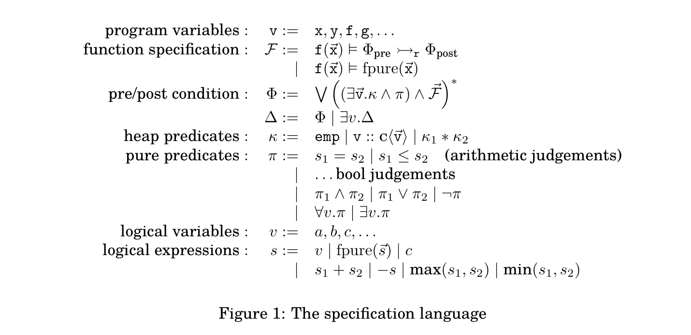
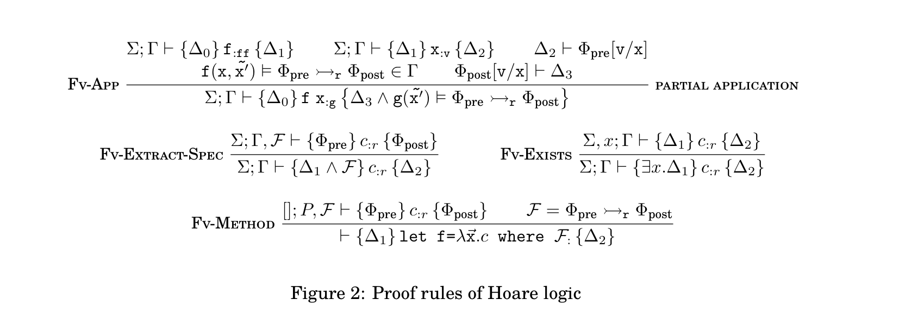

## Week 6 Discussion

### Assertion Language

### Rules

$\Sigma$: context of logical variables. 

$\Gamma$: context of specifications.

Remarks:

- FV-app deals with partial application, which basically creates a new instance of specification for function type. TODO: We did not deal with the separation frame here.
    
  > slightly different from the logic defined by yoshida, et al, who uses $m\cdot n=u\{C'\}$ to propagate the verification from an application to its abstraction.  We do the reverse. 

### Issues with current rules

- how to unify `fpure` when verifying a partial application?
  example: `t1_partial.ml`

  
