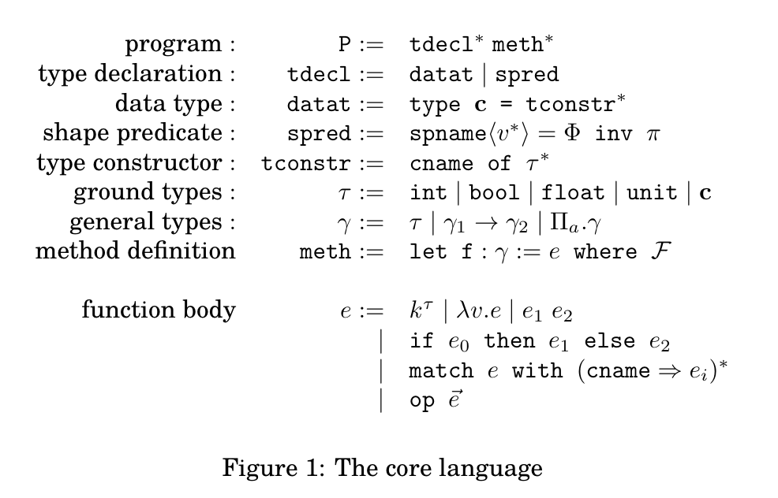
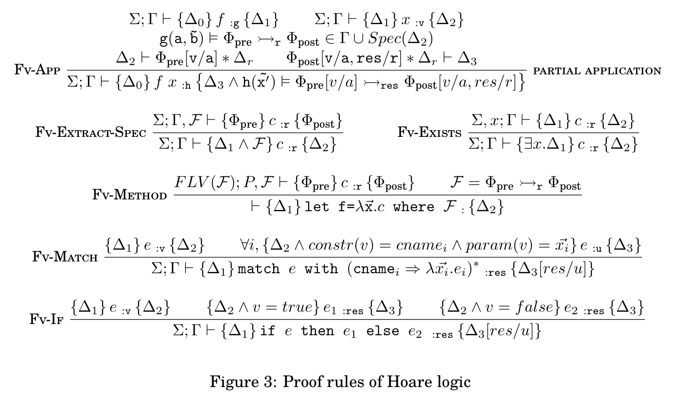

## The language


```Ocaml
let twice f x = f (f x)
(*   Requires      f(a) |= { true } *->:r { r=fpure(a) }
     Ensures[res]  res=fpure(fpure(a))
*)
```


> 
> - bool -> 0





## The rules



## More Examples

- Insertion sort with `cmp` as function parameter, with verification details
- Higher order fold function for binary tree


```OCaml
type list = Nil
          | Cons of (int * list)

(* LL<n> == self::Nil & n=0
          or self::Cons<i,q> * q::LL<n-1>
    inv min<=max & n>=1  *)

(* LLsort<n,min,max,cmpure> == self::Cons<min,q> * q::Nil & min=max & n=1
                     or self::Cons<min,q> * q::LLsort<n-1,k,max,cmpure> & cmpure(min, k) = true
    inv min<=max & n>0  *)


TotalOrder<cmpure>=
  forall a b c, cmpure(a,b)=true -> cmpure(b,c)=true -> cmpure(a,c)=true &
  forall a b, cmpure(a,b) = true -> cmpure(b,a)=true -> a=b
  forall a b. cmpure(a,b) = true | cmpure(b,a) = true

let rec sort cmp lst =
(* Requires      lst::LL<n> & n>0 & cmp(a,b) |= {TotalOrder<cmpure>} *->:r {r=cmpure(a,b)} 
   Ensures[res]  res::LLsort<n,mi,ma,cmpure> 

   Requires      lst::Nil
   Ensures[res]  res::Nil
*)
  match lst with
    Nil -> Nil
  | Cons (x, xs) -> insert cmp x (sort cmp xs)


and insert cmp elt lst =
(* Requires      lst::LLsort<n,mi,ma,cmpure> & cmp(a,b) |= {TotalOrder<cmpure>} *->:r {r=cmpure(a,b)} 
   Ensures[res]  res::LLsort<n+1,left,right,cmpure> 
                 & (cmpure(elt,mi) = true <-> left = elt )
                 & (cmpure(elt,mi) = false <-> left = mi )
                 & (cmpure(elt,ma) = true <-> right = ma )
                 & (cmpure(elt,ma) = false <-> left = elt )

  Requires      lst::Nil 
  Ensures[res]  res::Cons<elt,p> * p::Nil
```