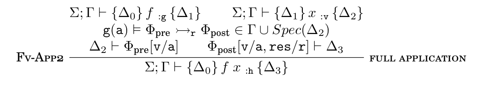
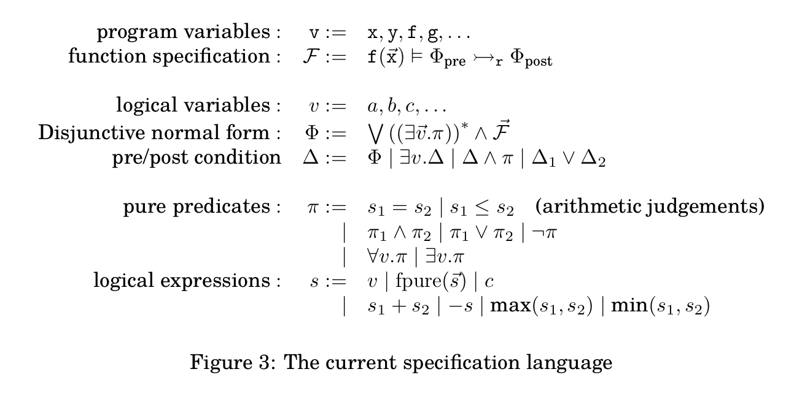

## Prototype System

- OCaml frontend
- Forward Verifier `hip.ml`
  

- AST for the assertion language `spectree.ml`

- Entailment checker `sleek.ml`

## Implementing the entailment checker with Z3

The trick of checking `forall [a....] [f], pre |- exists [b...] post`

The build-in quantifier of z3 only supports quantifying over basic sorts (`[a...]`, `[b...]`), therefore pure functions in assertions can only be encoded as top-level uninterpreted functions.

encode as `exists f, pre |-\- post`, or equivalently `exists f, pre /\ ~ post`, 
- if SAT returns true, then deriviation fails at the found x as a counterexample
- if SAT returns false, then entailment is checked
